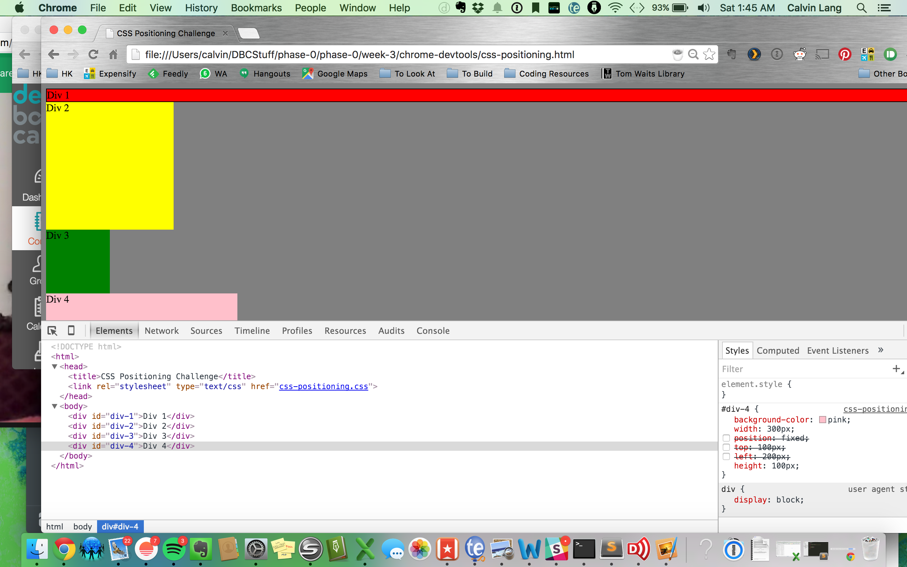
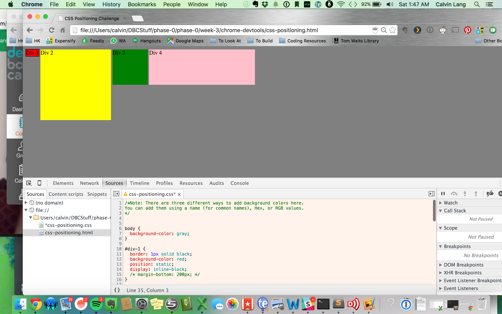
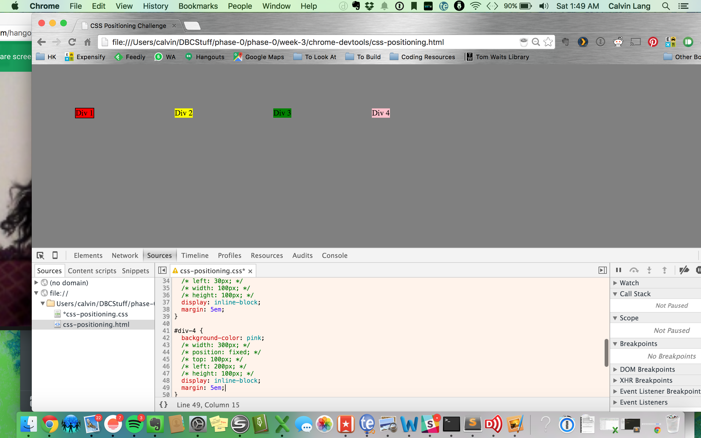
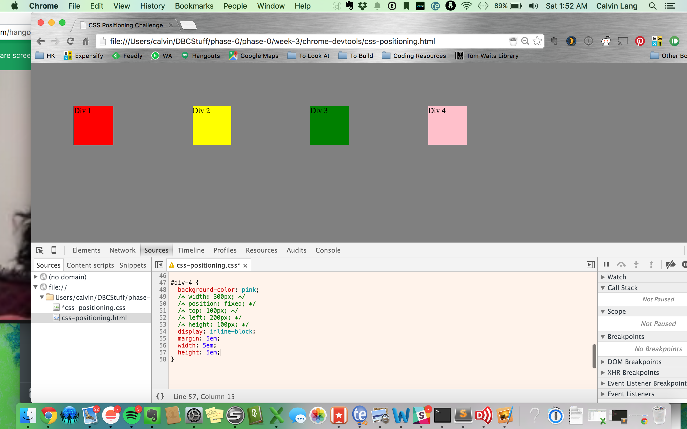
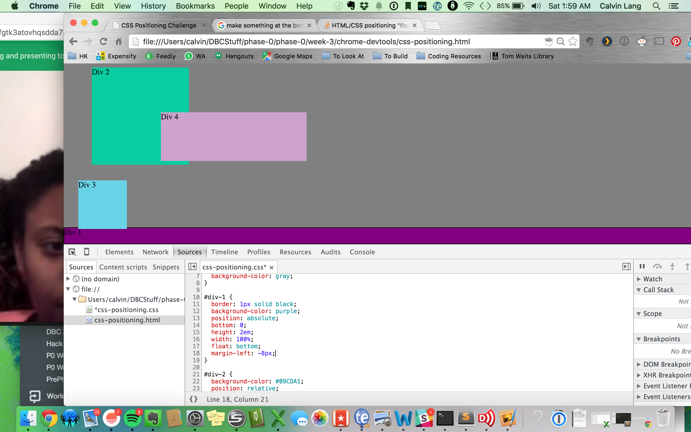
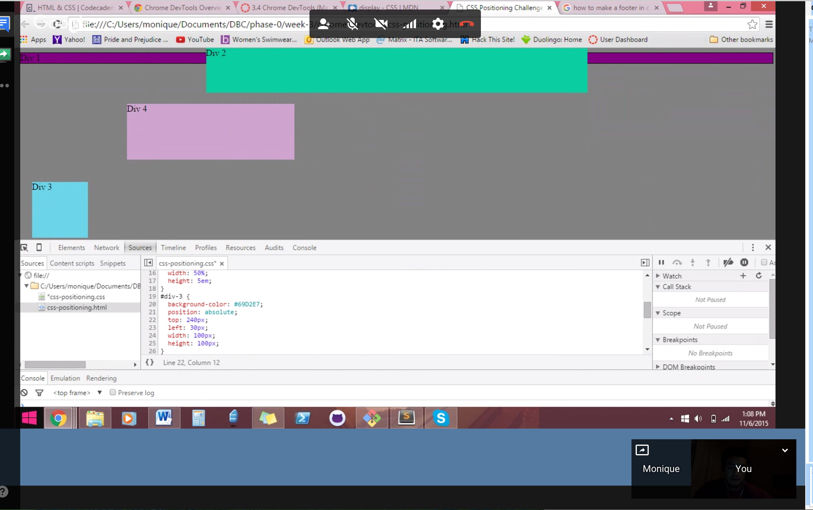
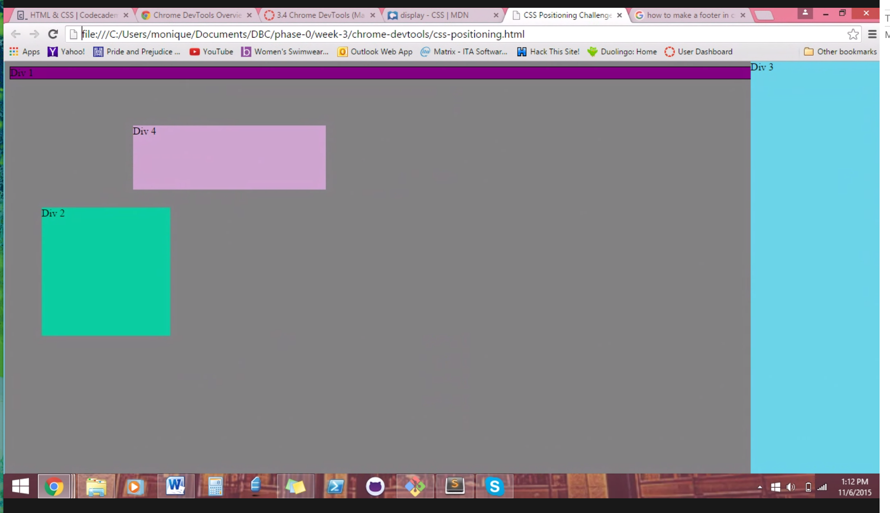
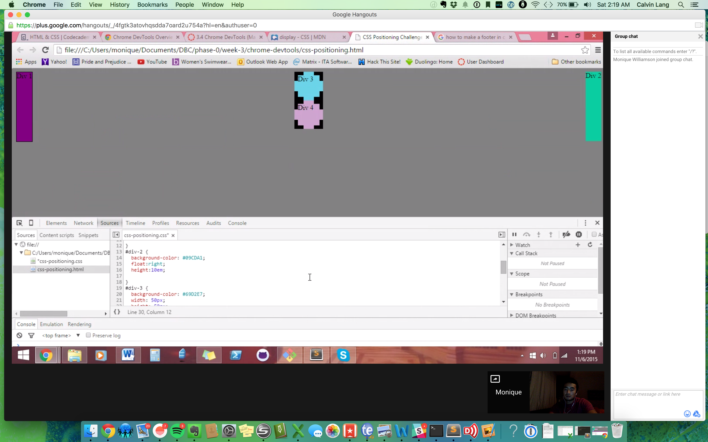

How can you use Chrome's DevTools inspector to help you format or position elements?
You can change the CSS on the page using the style section and see the changes right away without having to go back and forth in github or on your computer. 
How can you resize elements on the DOM using CSS?
What are the differences between absolute, fixed, static, and relative positioning? Which did you find easiest to use? Which was most difficult?
Honestly I am still a little fuzzy on those concepts. But from what I understand absolute is positioned in relation to the first parent element that isnt already set to static. Fixed means it has a fixed position that it does not move from. Relative is when the content is placed where it would have been if it had the default static. We didn't find any that were easy to use. We kind of fiddled around with it and went with what worked. 
What are the differences between margin, border, and padding?
Margin is pretty much the alloted space around the screen. The border is the edge of the content. Padding is the space bewteen the content and the border.  
What was your impression of this challenge overall? (love, hate, and why?)
It was fine I did not love it more than any of the lothers. I think that it was really useful to see how we can change a website right on Chrome. 